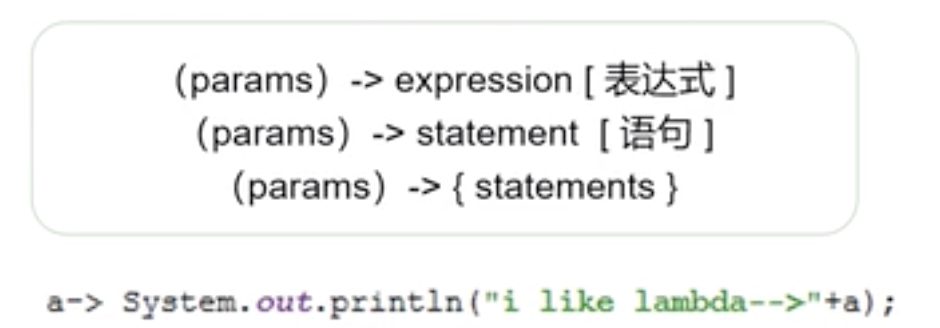
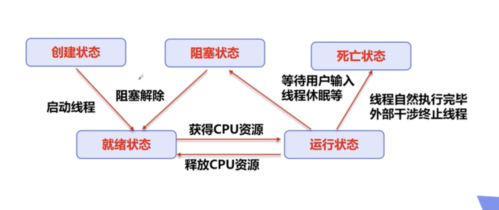
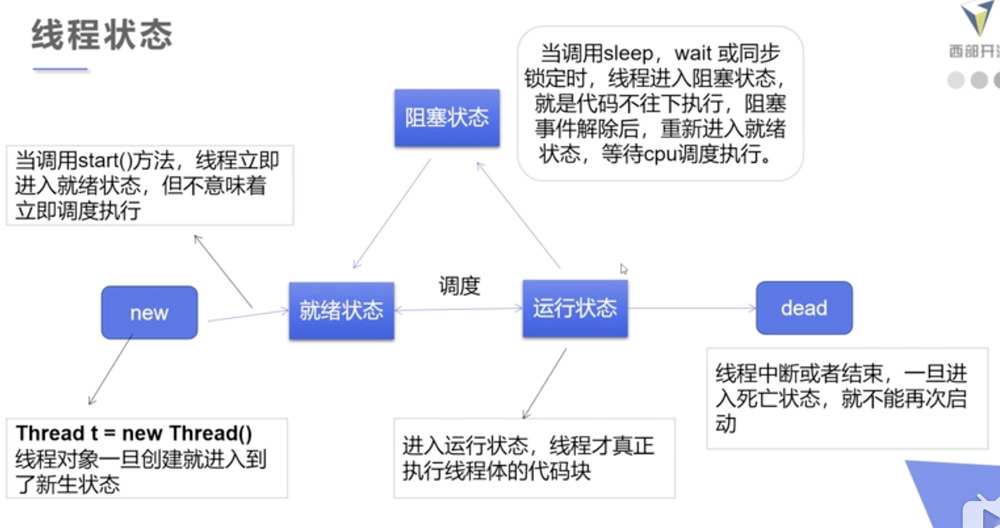
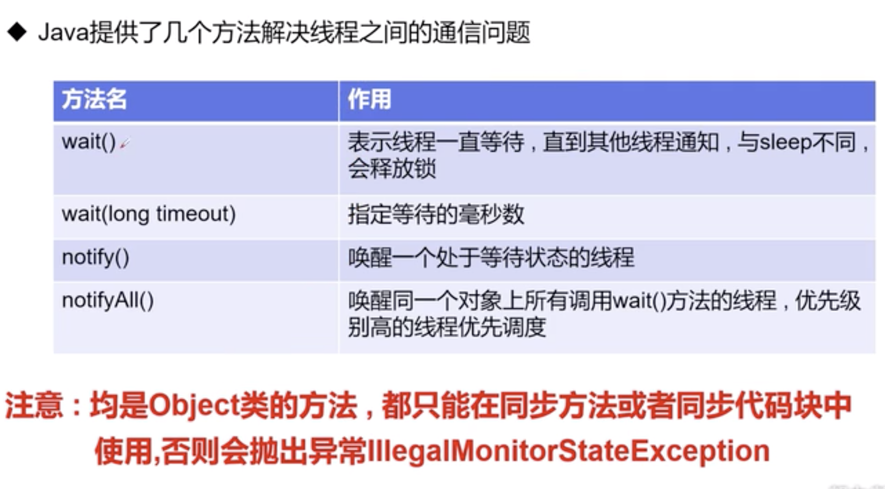
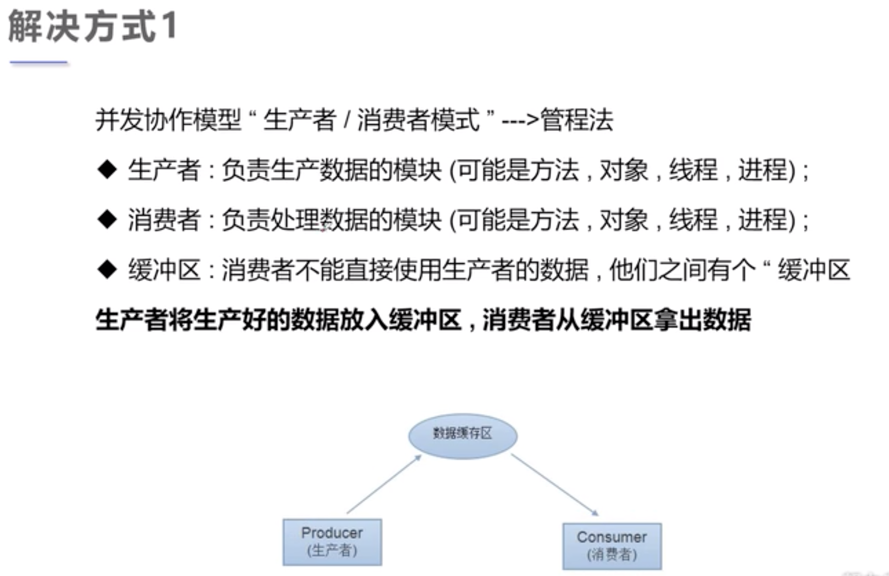
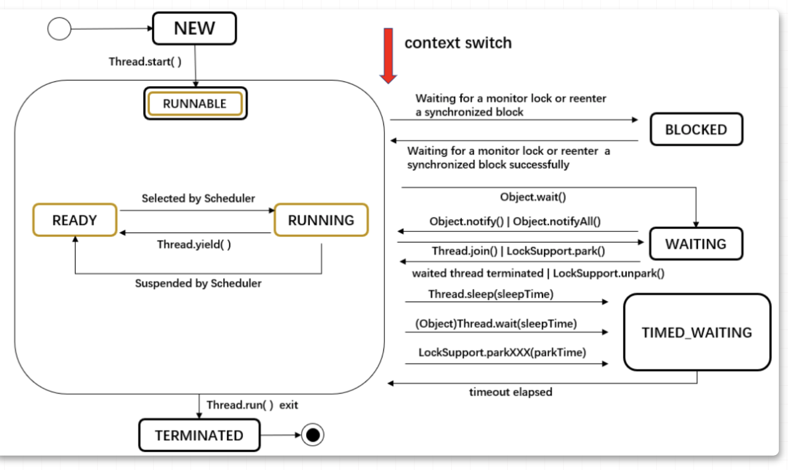

## 多线程

* 三种方式：Thread类，Runnable接口，Callable接口

```java
public class TestThread extends Thread {
  @Override
  run()
}
// 调用
TestThread tt = new TestThread();
tt.start()    // CPU调度安排
```

```java
public class TestThread implements Runnable {
  @Override
  run()
}
// 调用, new Thread() 静态代理方式
new Thread(tt).start()
```

_**推荐Runnable，避免单继承的局限性，方便同一个对象被多个线程使用**_

```java
public class TestThread implements Callable<返回值类型> {
  @Override
  public 返回值类型 call() {}
}
// 1.创建执行服务 new...Pool
// 2.提交执行    submit()
// 3.获取结构。  get()
// 4.关闭服务。  shutdownNow()
```

* 静态代理模式

  ```java
  interface Marry {
    marry()
  }
  class You implements Marry {}
  class WeddingCompany implements Marry {
    target;
    before();
    after();
    @Override
    marry(){
      before()
      target.marry()
      after()
    }
  } 
  
  // 在看线程,new Tread就是个静态代理
  new Tread(传入一个实现Runnable接口的对象).start()
  ```
* lambda表达式

  ```java
  new Tread( ()-> {System.out.println("Hello")} ).start()
  ```

  **解决一些class只new一次，避免匿名内部类定义过多**
  * 函数式接口functional interface

    **任何接口只包含唯一一个抽象方法**

    ```java
    public interface Runnable {
      public abstract void run();
    }
    ```

    **对于函数式接口，可以用lambda表达式来创建接口的对象**

    ```java
    interface ILike{
    	void lambda()
    }
    
    main {
      // 匿名内部类
      like = new ILike() {
        @Override
        public void lambda {
          ....
        }
      }
     	like.lambda()
      // lambda 简化。jdk8新增，
      like = () -> {...}
      like.lambda()
    }
    ```

    函数式编程，简化：

    
* 线程停止
  * 线程5大状态

  

  ​	
  * 停止方法

    **不推荐stop() destroy()方法，推荐要么自己停止，要么使用标志位进行终止**

    ```java
    class Test implements Runnable {
      private boolean flag = false;
      
      @Override
      public void run() {
        ... 
        if flag = true, return;
      }
      
      // 转换标志位
      public stop() {
    		flag = true;
      }
    }
    ```
* 线程休眠，sleep，线程进入就绪状态

  **模拟网络延时：放大问题的发生性**

  **模拟倒计时**

  ```java
  Thread.sleep()
  ```
* 线程礼让 yield

  **让当前执行的线程暂停，但不阻塞**

  **线程从运行转为就绪状态**

  **让CPU重新调度，礼让不一定成功，看CPU心情**

  ```java
  Thread.yield()
  ```
* 线程强制执行 join

  **join合并线程，就是插队，此线程执行完成了，在执行其他的线程，其他线程都阻塞着**

  ```java
  thread = new Thread(testJoin)
  thread.start()
  thread.join()
  ```
* 线程状态观测 Thread.State

  ```java
  threadObj.getState()
  ```

  **线程中断或者结束，就不能重新启动**
* 优先级

  1～10，线程调度器按照优先级，优先级低意味着获得调度的**概率低**。权重思想，性能倒置
* 守护daemon线程

  线程分为**用户线程**和**守护线程**

  后台记录日志，监控内存，垃圾回收等等

  Java虚拟机必须确保用户线程执行完毕，不用等待守护线程执行完毕

  ```java
  // main()用户线程
  main() {
  	threadObj.setDaemon(true)
    threadObj.start()
    threadObj_1.start()
  }
  // treadObj_1 完成 -> main() 完成 -> 程序退出exit code 0
  ```
* 线程同步
  * 解决办法：排队 -> 队列

    并发，使用同一个资源，需要线程同步，其实就是一种**等待机制**，多个线程进入这个**对象的等待池**形成队列。
  * 队列 + 锁，解决安全性

    **每个对象都有一把锁** synchronized

    每个线程都有自己的工作内存，Thread.currentThread()

    ```java
    class BuyTicket implements Runnable {
      private ticketNums = 10;
      @Override
      run(){
        while(flag){
          buy()
        }
      }
      
      buy(){
        if ticketNums < 0 flag = true, return;
        print(Thread.currentThread().getName() + “拿到” + ticket--)
      }
    }
    
    main() {
      BuyTicket station = new BuyTicket()
      // 多个线程操作同一个对象  
      new Thread(station, "我").start()
      new Thread(station, "黄牛").start()
    }
    ```

    Synchronized 方法 和  synchronized  块

    ```java
    // 同步方法：默认锁的是this，同步监视器是this，就是这个对象本身，或者是class
    public synchronized void method(){}
    
    // 同步块
    synchronized(Obj){...对着个obj操作的代码块...}，// 这个obj称之为同步监视器
    ```
* java JUC 安全类型的集合

  ```java
  import java.util.concurrent.XXXXX
  ```
* Lock 锁

  ```java
  // JDK5
  // 可重入锁  ReentrantLock 实现了Lock的接口
  ReentrantLock lock = new ReentrantLock()
  try {
    lock.lock()
  } finally {
  	lock.unlock()
  }
  ```
* 线程协作

  生产者消费者问题，不是模式，解决相互依赖，互为条件





```java
class Consumer extends Thread {
	SynContainer container
  run(){
     for 100: container.pop()
  }
    
}
class Productor extends Thread {
  SynContainer container
	run(){
    for 100: container.push(new Chicken())
  }
}

class Chicken {}
class SysContainer {
  	Chicken[] chickens = new Chicken[10]
    int count = 0;
    // 消费者用的方法
  	synchronized pop(){
      if 取空了，需要消费者等待: this.wait()
      if 如果取成功了，没有空，通知生产者和消费者继续，this.notifyAll()
    }
    // 生产者用的方法
  	synchronized push(){
      if 有产品, 没满，通知消费者和生产者: this.notifyAll()
      if 满了，让生产者等待: this.wait()
    }
}
```


```java
// 和上一个例子一样 就是Chicken length = 1了，变成标志位
// SysContainer 里面的 Chicken[] chickens 变成”信号灯“，flag标记位
Class TV(){
  boolean flag = true;
  synchronized void play(){
    if(!flag){
      this.wait()  //演员等待
    }
    this.notitfyAll()
  }
  
  synchronized void watch(){
    if(flag){
      this.wait();
    }
    this.notifyAll()
  }
}
// 生产者
Class Player extends Thread { play() }
// 消费者
Class Watcher extends Thread { watch() }
// 

main(){
  tv = new TV()
  new Player(tv).start()
  new Watch(tv).start()
}
```

* 线程池

  ExecutorService 线程池接口

  Executors 线程池工厂类
* 总结：https://www.bilibili.com/video/BV1V4411p7EF?p=28

## 其他文章

> 文章：https://mp.weixin.qq.com/s/kie8kEa-v5es_QAPTzNCWg



* \[进程 -> 轻量级进程（JVM里）\] -> 系统内核线程 -> 线程调度器
* 上下文切换
* 监控线程状态
  几款工具